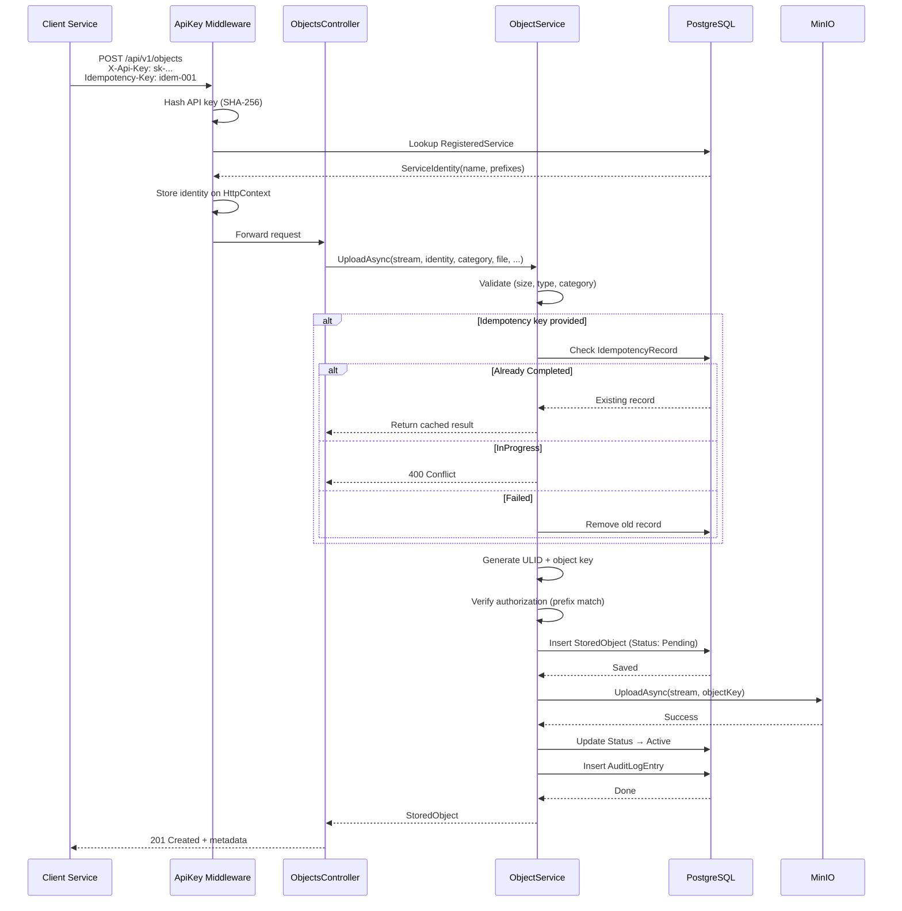

<div align="center">

# Object Storage Service

**A production-ready internal object storage API built with .NET 10, MinIO, and PostgreSQL.**

Clean architecture, service isolation, idempotent uploads, audit logging, and full observability.

[](https://dotnet.microsoft.com)
[](https://min.io)
[](https://www.postgresql.org)
[](#)

</div>

---

## Why This Exists

Other backend services need to store and retrieve files, but directly depending on MinIO creates coupling. This service provides a clean HTTP API that:

- **Hides MinIO** behind a storage abstraction
- **Isolates services** — each service can only access its own objects
- **Handles idempotency** — safe retries on network failures
- **Logs every operation** — audit trail for compliance
- **Exposes metrics & traces** — OpenTelemetry integration

---

## Architecture

```
┌─────────────────────────────────────────────────────────────┐
│                     Company Services                        │
│                    (DocumentService,                        │
│                     InvoiceService, etc.)                   │
└───────────────────────────┬─────────────────────────────────┘
                            │  REST API
                            ▼
┌─────────────────────────────────────────────────────────────┐
│                  Object Storage API                         │
│                                                             │
│  ┌─────────┐  ┌──────────────┐  ┌─────────────────────┐    │
│  │  Auth    │  │  Validation  │  │  Idempotency        │    │
│  │  (API    │  │  (size,      │  │  (duplicate         │    │
│  │   Key)   │  │   type,      │  │   protection)       │    │
│  │          │  │   category)  │  │                     │    │
│  └─────────┘  └──────────────┘  └─────────────────────┘    │
│                                                             │
│  ┌──────────────────┐  ┌──────────────┐  ┌──────────────┐   │
│  │  Object Service   │  │  Audit Log   │  │  Telemetry   │   │
│  │  (orchestrator)   │  │  (PostgreSQL)│  │  (OTel)      │   │
│  └────────┬─────────┘  └──────────────┘  └──────────────┘   │
└───────────┼─────────────────────────────────────────────────┘
            │
            ▼
┌───────────────────────┐       ┌───────────────────────┐
│   MinIO (S3)          │       │   PostgreSQL          │
│   - File contents     │       │   - Metadata          │
│   - Presigned URLs    │       │   - Audit logs        │
│   - Object lifecycle  │       │   - Service registry  │
└───────────────────────┘       └───────────────────────┘
```

**Dependency flow:** `Api → Application → Domain`, with `Infrastructure` implementing Domain/Application abstractions.

### Request Flow



---

## Tech Stack

| Component | Technology | Purpose |
|-----------|-----------|---------|
| **Runtime** | .NET 10 (LTS) | Cross-platform, high-performance |
| **API** | ASP.NET Core Web API | REST endpoints with ProblemDetails |
| **Object Storage** | MinIO 7.0 | S3-compatible file storage |
| **Database** | PostgreSQL 16 | Metadata + audit logs |
| **ORM** | Entity Framework Core | Code-first migrations |
| **Auth** | API Key (SHA-256) | Service-to-service isolation |
| **Observability** | OpenTelemetry | Distributed tracing + metrics |
| **Testing** | xUnit + Testcontainers | Unit + integration tests |
| **Containerization** | Docker Compose | Local dev stack |

---

## Features

### Service Isolation

Each service gets an API key that maps to allowed path prefixes. A service cannot access another service's objects.

```
DocumentService  →  documents/*
InvoiceService   →  invoices/*
UserService      →  users/*
```

### Idempotent Uploads

Retry-safe with the `Idempotency-Key` header:

| Scenario | Behavior |
|----------|----------|
| First request | Creates object, returns `201` |
| Duplicate (completed) | Returns cached result, no re-upload |
| Duplicate (in progress) | Returns `400` |
| Duplicate (failed) | Allows fresh retry |

### Presigned URLs

For large files, skip the API proxy entirely:

```
Client → API (authorize + generate) → MinIO presigned URL → Client downloads directly
```

### Audit Logging

Every operation logged to PostgreSQL with:

- Service name, operation type, object ID
- Result (success/failure), correlation ID
- Timestamp, IP address, metadata

### Observability

| Metric | Type | Description |
|--------|------|-------------|
| `objectstorage.upload.size_bytes` | Histogram | Upload size distribution |
| `objectstorage.download.size_bytes` | Histogram | Download size distribution |
| `objectstorage.operations.total` | Counter | Operations by type + result |
| `objectstorage.auth_failures.total` | Counter | Authorization failures |

Distributed tracing via `ActivitySource("ObjectStorage.MinIO")` with semantic tags on every MinIO operation.

### Security

- API key authentication (SHA-256 hashed, never stored raw)
- Security headers on every response (nosniff, DENY frame, HSTS)
- Read-only Docker filesystem with `no-new-privileges`
- Server-generated object keys (no client-controlled paths)
- Configurable file size limits and content type whitelists

---

## API Reference

### Upload

```http
POST /api/v1/objects
Content-Type: multipart/form-data
X-Api-Key: <your-api-key>
Idempotency-Key: <optional-unique-key>

file=@document.pdf
category=documents
```

**Response:** `201 Created`
```json
{
  "id": "01K2G5H8R9N3X7B4T6Y1V8J2Q",
  "fileName": "document.pdf",
  "contentType": "application/pdf",
  "size": 1048576,
  "createdAt": "2026-09-12T10:30:00Z"
}
```

### Download

```http
GET /api/v1/objects/{id}/download
X-Api-Key: <your-api-key>
```

**Response:** `200 OK` (binary stream)

### Get Metadata

```http
GET /api/v1/objects/{id}/metadata
X-Api-Key: <your-api-key>
```

**Response:** `200 OK`
```json
{
  "id": "01K2G5H8R9N3X7B4T6Y1V8J2Q",
  "fileName": "document.pdf",
  "contentType": "application/pdf",
  "size": 1048576,
  "createdAt": "2026-09-12T10:30:00Z"
}
```

### Delete

```http
DELETE /api/v1/objects/{id}
X-Api-Key: <your-api-key>
```

**Response:** `204 No Content`

### Generate Presigned URL

```http
POST /api/v1/objects/{id}/presigned-url
X-Api-Key: <your-api-key>
Content-Type: application/json

{
  "expirationSeconds": 3600
}
```

**Response:** `200 OK`
```json
{
  "url": "http://minio:9000/objectstorage/...?X-Amz-Signature=...",
  "expiresAt": "2026-09-12T11:30:00Z"
}
```

---

## Quick Start

### Prerequisites

- [.NET 10 SDK](https://dotnet.microsoft.com/download/dotnet/10.0)
- [Docker Desktop](https://www.docker.com/products/docker-desktop/)

### 1. Clone and configure

```bash
git clone https://github.com/yourusername/ObjectStorage.git
cd ObjectStorage
cp docker/.env.example docker/.env
```

### 2. Start the stack

```bash
docker compose -f docker/docker-compose.yml up --build
```

This starts:

| Service | URL |
|---------|-----|
| API | http://localhost:8080 |
| MinIO Console | http://localhost:9001 |
| PostgreSQL | localhost:5432 |

### 3. Test it

```bash
# Upload a file
curl -X POST http://localhost:8080/api/v1/objects \
  -H "X-Api-Key: dev-bypass-key" \
  -F "file=@myfile.pdf" \
  -F "category=documents"

# Check health
curl http://localhost:8080/health/ready
```

### 4. Run tests

```bash
# Unit tests (fast, no Docker needed)
dotnet test tests/ObjectStorage.UnitTests/

# Integration tests (spins up real PostgreSQL + MinIO via Testcontainers)
dotnet test tests/ObjectStorage.IntegrationTests/
```

---

## Project Structure

```
src/
├── ObjectStorage.Api/                  # HTTP endpoints, middleware, DI wiring
│   ├── Controllers/                    # REST API
│   ├── Contracts/                      # Request/Response DTOs
│   └── Program.cs                      # Application entry point
│
├── ObjectStorage.Application/          # Business logic (no infrastructure deps)
│   ├── Configuration/                  # Strongly-typed options
│   ├── Entities/                       # IdempotencyRecord, AuditLogEntry
│   ├── Interfaces/                     # Repository/service abstractions
│   └── Services/                       # ObjectService (the orchestrator)
│
├── ObjectStorage.Domain/               # Core rules (zero dependencies)
│   ├── Entities/                       # StoredObject, ServiceIdentity
│   ├── Exceptions/                     # Domain exception hierarchy
│   ├── Interfaces/                     # IObjectStorage, IServiceIdentity
│   └── ValueObjects/                   # ObjectMetadata
│
└── ObjectStorage.Infrastructure/       # Real implementations
    ├── Configuration/                  # DI registration, options binding
    ├── Middleware/                      # ApiKeyMiddleware, SecurityHeaders
    ├── MinIO/                          # MinIO SDK wrapper + health check
    ├── Persistence/                    # EF Core, migrations, health check
    ├── Services/                       # ULID generator, key generator, auth resolver
    └── Telemetry/                      # OpenTelemetry metrics + tracing

tests/
├── ObjectStorage.UnitTests/            # 79 tests (fakes, no infrastructure)
└── ObjectStorage.IntegrationTests/     # 22 tests (Testcontainers)

docker/
├── docker-compose.yml                  # Full local dev stack
└── .env.example                        # Environment variable template
```

---

## Configuration

All settings are strongly-typed and validated at startup. In Docker, override via environment variables using `__` separator.

| Setting | Default | Description |
|---------|---------|-------------|
| `Storage:MaxFileSizeBytes` | `104857600` (100 MB) | Maximum upload size |
| `Storage:AllowedCategories` | `["documents","images","invoices","backups"]` | Allowed upload categories |
| `Storage:AllowedContentTypes` | `["application/pdf","image/png",...]` | MIME type whitelist (`["*"]` for all) |
| `Storage:MaxPresignedUrlExpirationSeconds` | `604800` (7 days) | Maximum presigned URL lifetime |
| `Auth:HeaderName` | `X-Api-Key` | API key header name |
| `Auth:SkipInDevelopment` | `true` | Allow dev-bypass-key in Development |

---

## License

MIT
